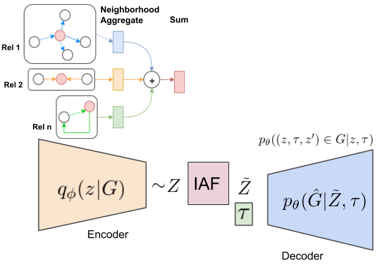
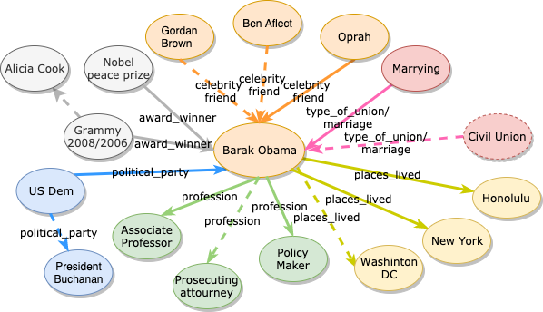

# KGVAE
Infer relationships from knowledge graphs

## Abstract
Knowledge graphs are powerful abstraction to represent relational facts among entities. Since most real world knowledge graphs are manually collected and largely incomplete, predicting missing links from given graph becomes crucial for knowledge graph to be more useful. Recently many studies have shown promising results by embedding entities and relation in a vector space. However, a common issue with most point estimates methods is that they could fail to capture more complex structures such as one-to-many, or many-to-many relations, nor can they adapt to scenarios where entities and relations have intrinsic uncertainties and multiple semantic meanings. To this end, we consider a probabilistic framework and propose GCN-VAE, a variantaional autoencoder to encode entities' neighborhood structure into a compact latent embedding distribution and reconstruct the links between entities by estimating edge likelihood via a decoder. We demonstrated the effectiveness of GCN-VAE on two popular benchmarks and got improved performance over state-of-the-art baselines on FB15k-237.

## Methods

 Given an input graph defined on local neighborhood, the encoder uses graph convolutional neural network to aggregate an entity's neighborhood, and outputs the mean and variance of latent embedding distribution. It then samples a latent code $z$ from the distribution. In one of our proposed models that utilizes IAF (inverse autoregressive flow), the latent codes Z first goes through 3 layers of IAF transform to form a more complex non-Gaussian posterior. Lastly, conditioned on relations, the decoder takes in sampled latent codes and relation embedding, and outputs likelihood scores for possible triplets.

## Evaluation

 
Sampled new links for Obama’s neighborhood. The dotted lines are suggested by GCN-VAEas highest valued triplets that are not in original dataset.
